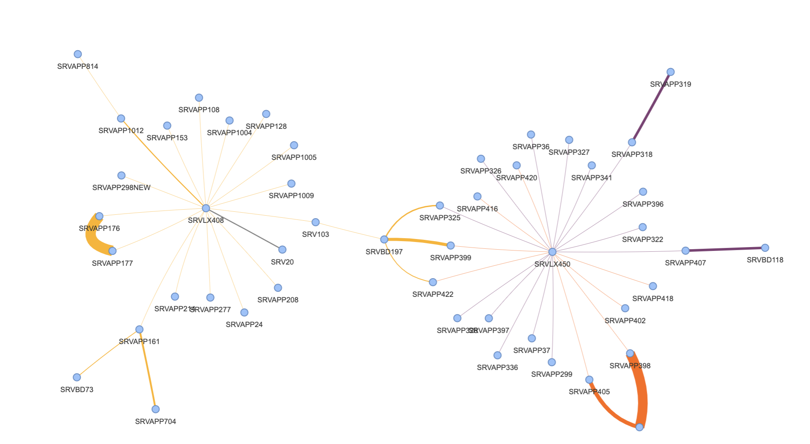
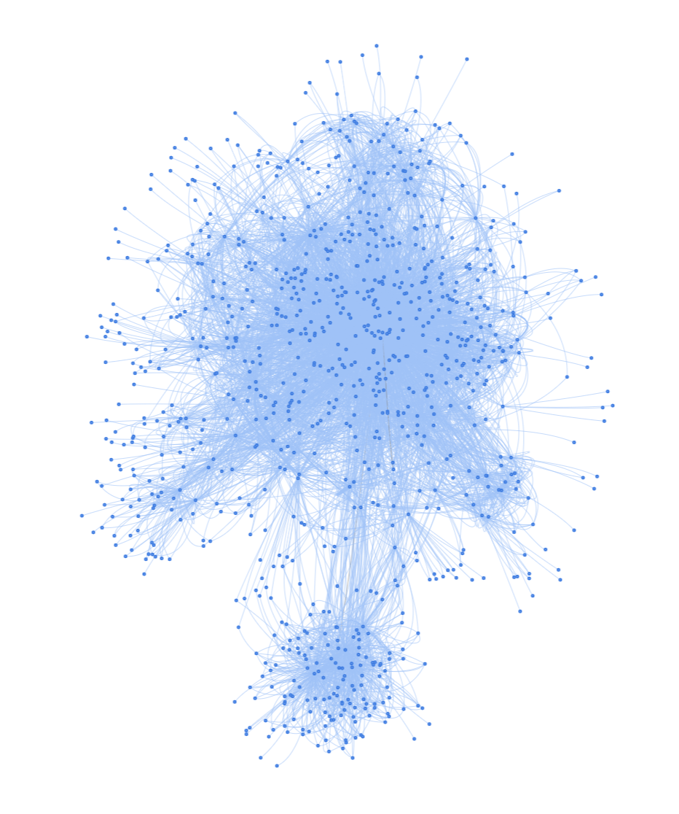

# Dependency Plot
![version][version-img] 

This sample use pyhton module to process Stratozone Dependencies.
Here we have two samples:
* Simple Plot(simple_graph_plot.ipynb) -  consume a csv file alread processed to just plot information.
* Original Dependency(graph_plot.ipynb) File -work with original SZ file.

# Processing
This is a simple graph will handle from,to, weight. However for any reson if is possible to obtain more acurate relevance you can add extra fields to enhance the study.

## Phases:
* Data Clenup:  Remove infrastructure work like: ssh,  backup servers, probes, Anti Virus Scanners, Security Probes.
* Remove Duplication: for both approaches eliminate repeted from,to pairs
* header: minimum required headers are: from, to, weight. Last one you can also fix a numeric value but this can be the numeric comunication field
* remove lower communication normally 1500 is a nice start.

You can use this initial wok to provide an vision of asset communications.
 
You can also improve the model create an extra field and provide services dependencies.

The initial dependency pot  created using StratoZone dependecy map csv with zero changes. Can be a nice start to focos the clenup strategy.
 

Enjoy!

<!-- Markdown link & img dfn's -->
[version-img]: https://img.shields.io/badge/version-1.0-green